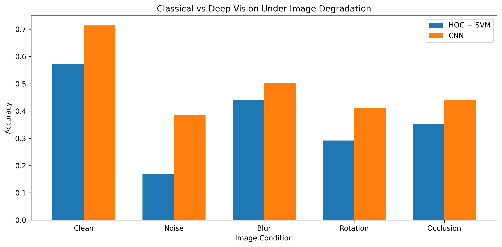

# Classical vs Deep Vision

## Project Overview

This project explores the difference between **classical computer vision** and **deep learning-based visual recognition** using the CIFAR-10 dataset.

The project compares two image-classification approaches:

* **Classical Vision:** Grayscale image → HOG feature extraction → SVM classifier
* **Deep Vision:** RGB image → Convolutional Neural Network (CNN) implemented in PyTorch

The main goal is not only to compare classification performance on clean images, but also to study how both approaches respond when image quality is degraded.

The models are evaluated under:

* Clean images
* Gaussian noise
* Gaussian blur
* Rotation
* Occlusion

---

## Dataset

The experiments use the **CIFAR-10** dataset.

CIFAR-10 contains 60,000 RGB images divided into 10 object categories:

* Airplane
* Automobile
* Bird
* Cat
* Deer
* Dog
* Frog
* Horse
* Ship
* Truck

Each image has a resolution of **32 × 32 pixels**.

The dataset contains:

* 50,000 training images
* 10,000 test images

---

## Classical Computer Vision Pipeline

The classical pipeline uses handcrafted visual features.

```text
RGB Image
   ↓
Grayscale Conversion
   ↓
HOG Feature Extraction
   ↓
Feature Vector
   ↓
SVM Classifier
   ↓
Predicted Class
```

### Histogram of Oriented Gradients

HOG represents an image using local gradient directions and edge structures. Instead of learning features automatically, HOG explicitly extracts information related to object shape and image intensity changes.

### Support Vector Machine

An SVM with an RBF kernel is trained using the extracted HOG feature vectors.

The classical model achieved a clean-image test accuracy of:

**57.3%**

---

## Deep Learning Pipeline

The deep-learning approach uses a custom convolutional neural network implemented with **PyTorch**.

```text
RGB Image
   ↓
Convolution
   ↓
ReLU
   ↓
Max Pooling
   ↓
Convolution
   ↓
ReLU
   ↓
Max Pooling
   ↓
Convolution
   ↓
ReLU
   ↓
Max Pooling
   ↓
Fully Connected Layers
   ↓
10-Class Prediction
```

Unlike the classical pipeline, the CNN learns its visual representations directly from the training images.

The CNN achieved a clean-image test accuracy of:

**71.4%**

---

## CNN Training

The CNN was trained for five epochs.

### Training Accuracy


The training accuracy increased consistently during training, showing that the CNN progressively learned useful representations from the CIFAR-10 images.

### Training Loss


The decrease in training loss indicates that prediction errors were reduced as the network weights were optimized.

---

## Image Degradation Experiments

To study model robustness, the test images were modified using four controlled degradations.

### Gaussian Noise

Random Gaussian noise was added to pixel values to simulate noisy image acquisition.

### Gaussian Blur

Gaussian filtering was applied to reduce sharp image details and edge information.

### Rotation

Images were rotated to evaluate sensitivity to changes in object orientation.

### Occlusion

A region of each image was covered to simulate partially hidden objects.

### Example Degradations


---

## Robustness Evaluation

Both HOG + SVM and the CNN were evaluated using exactly the same test conditions.

```text
                     CIFAR-10 Test Images
                              |
                ┌─────────────┴─────────────┐
                |                           |
             HOG + SVM                    CNN
                |                           |
                └─────────────┬─────────────┘
                              |
              Apply Image Degradations
                              |
          ┌────────┬────────┬──────────┬───────────┐
          |        |        |          |
        Noise     Blur    Rotation   Occlusion
          |        |        |          |
          └────────┴────────┴──────────┴───────────┘
                              |
                    Compare Accuracy
```

### Results

| Condition | HOG + SVM Accuracy | CNN Accuracy |
| --------- | -----------------: | -----------: |
| Clean     |              57.3% |        71.4% |
| Noise     |         Add result |   Add result |
| Blur      |         Add result |   Add result |
| Rotation  |         Add result |   Add result |
| Occlusion |         Add result |   Add result |

The complete numerical results are also available in:

`results/robustness_results.csv`

---

## Robustness Comparison



This comparison shows how classification performance changes when the visual input is degraded.

Instead of considering only clean-image accuracy, the project also evaluates the **performance drop relative to the clean baseline**.

A smaller performance drop indicates greater robustness to that particular type of image degradation.

---

## Key Findings

* The custom CNN achieved higher clean-image classification accuracy than the HOG + SVM baseline.
* The CNN achieved **71.4%** accuracy on clean test images compared with **57.3%** for HOG + SVM.
* Classical HOG features rely on manually designed gradient and shape information.
* CNNs learn visual representations automatically from training images.
* Image degradation can significantly influence classification performance.
* Different degradations affect handcrafted and learned representations differently.
* Evaluating robustness provides additional information beyond clean-image accuracy alone.

---

## What This Project Demonstrates

This project provides a practical comparison between two generations of computer vision methodology:

### Classical Computer Vision

```text
Human-designed visual features
          ↓
         HOG
          ↓
         SVM
```

### Deep Computer Vision

```text
Raw RGB Images
      ↓
     CNN
      ↓
Automatically Learned Features
```

The project demonstrates fundamental concepts including:

* Digital image representation
* RGB and grayscale images
* Image tensors
* Image gradients
* HOG feature extraction
* Support Vector Machines
* Convolutional Neural Networks
* Convolution and pooling
* Backpropagation
* Image degradation
* Model robustness
* Classification accuracy
* Error and performance analysis

---

## Technologies

* Python
* PyTorch
* torchvision
* OpenCV
* NumPy
* Matplotlib
* scikit-image
* scikit-learn
* Pandas
* Jupyter Notebook

---

## Purpose

This project was developed as a practical study of fundamental computer vision concepts and the transition from handcrafted feature engineering to learned deep representations.

It is intended as an educational and experimental implementation rather than a claim of a novel computer vision method.
